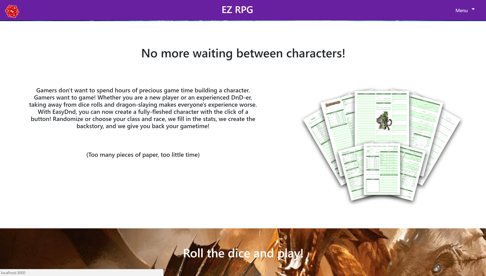
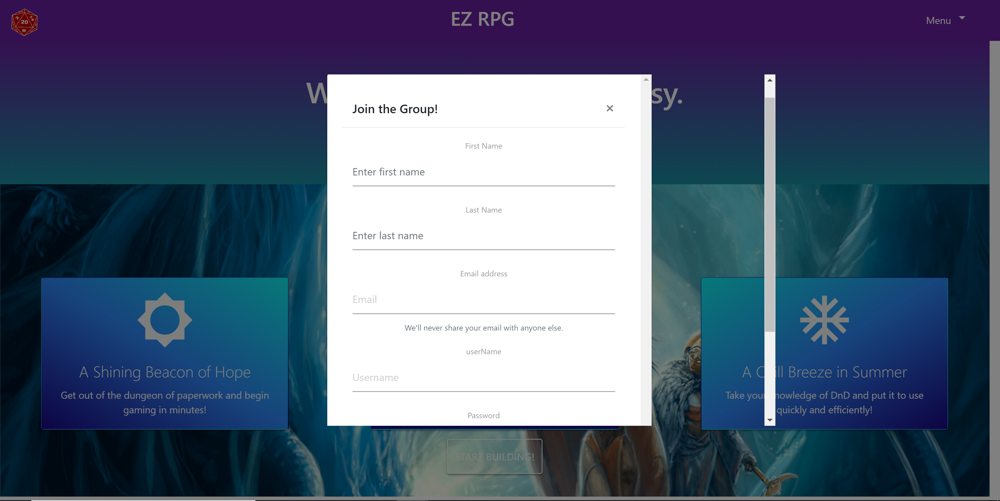
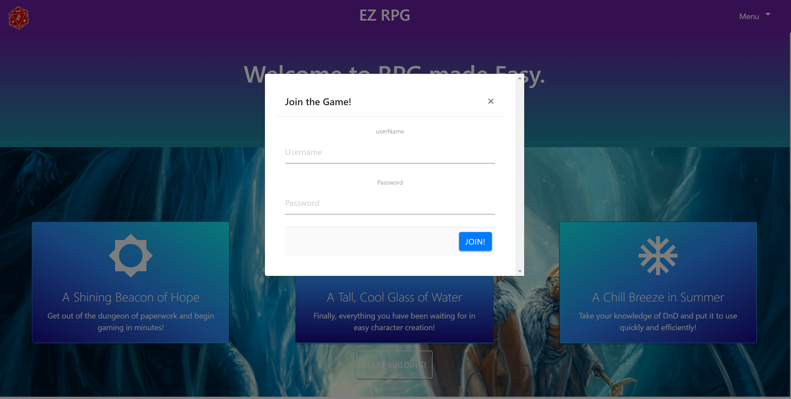
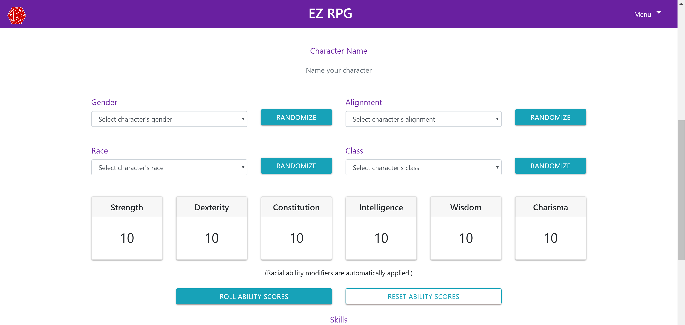
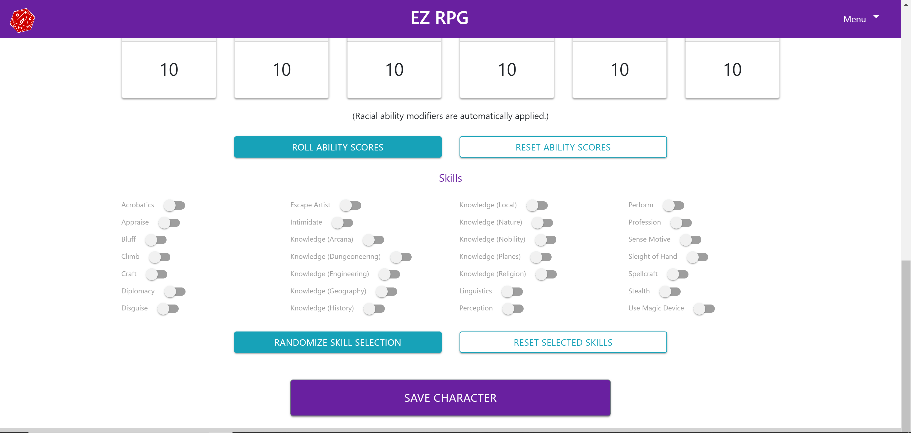

# EZ RPG*

## Character Creation Made EZ

EZ RPG is a self-contained Role Playing Game character creation app. In this app, you can log-in or sign-up and create randomized (or self-picked) characters for any RPG (Examples could be Dungeons and Dragons or Pathfinder, among others). In this app, you are able to create and save your characters to be called later so you can always have a character ready between gaming sessions. With EZ RPG, character building has never been EZ-er! 

(we apologize for that terrible pun)

EZ RPG can be found <a href='https://ezrpg.herokuapp.com/' target='_blank'>here</a>!

## Languages/Technologies Used

EZ RPG uses HTML, CSS, Javascript, React.js, Express, Node.js, Passport, mySQL, Materialize, Bootstrap, and clearDB. 

# Sign Up and Login

Login and Sign Up is done through modals. After logging in or signing up, you are then directed to the dashboard page for any characters being held from previous log-ins. 

# Dashboard

The dashboard page is where characters that are previously created can be stored and called back to. This helps keep things convenient for the user as well as keeps continuity between gaming sessions.

# The Build

The character build page is where the creation happens. Users are able to choose from four properties: Gender, Alignment, Race, and Class. They can either randomize their choices or choose the configuration that works best for them. For their ability scores, we use a 'rolled score' function that 'rolls' four six-sided dice and then subtracts the lowest of the four to give the total ability score. Racial bonuses to ability scores are factored into the total scores. For races where bonuses can be attributed to any ability, the system gives a bonus to a random score. The user can then assign skill ranks based on the number of skills available to them (based on their class and INT ability modifier (Ability Score - 10 / 2 rounded down)). The user can then save the character to their dashboard once they are happy with it. 

# The Character Page

The Character Page displays the information about the character. The background image changes based on the class of the character, and the Ability Scores as well as skills and skill bonuses are displayed underneath. In the image below, we have mocked up a sample of what the finished character sheet would be in essence. 

# Future Developments

With an application like this, the possibilities are infinite. Continued work includes making the build page more cohesive and give more choices to the user in terms of where randomized ability scores land (with a potential drag and drop feature) as well as adding in typical aspects of character creation like movement speeds, offensive and defensive abilities, and equipment. This would also impact the character page and really help create a more complete and fleshed-out application. This was our final group project for our six month coding bootcamp, so there is a lot more to learn and a lot more building to do. 

# Github Accounts for Group Members

Check us out! We would love to hear from you!

Zack Muenz: https://github.com/zmuenz

Kelsey Gasser: https://github.com/kjgasser

Rachel Punches: https://github.com/rpunches

Scott Salem: https://github.com/maldrek

*We do not own any rights to Dungeons or Dragons or Wizards of the Coast, as well as the images involved in this build. The images used were for the specific purpose of giving a clean finish and will not be used or sold commercially unless rights are obtained. 
